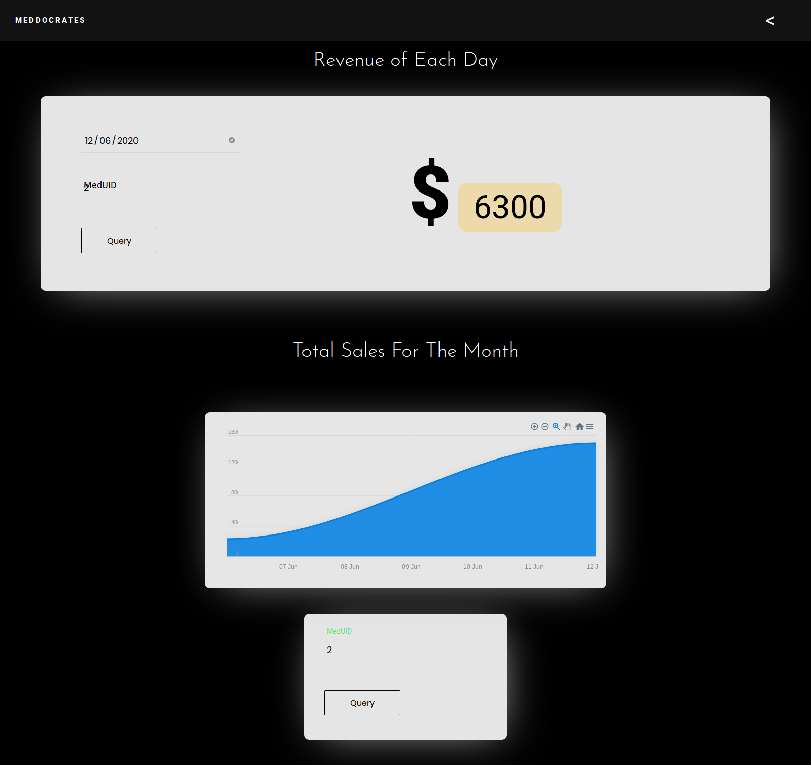

# Meddocrates
A retail management software for a pharmacy, using Strapi and vanilla Frontend. `Meddocrates is a wordplay by combining Medicine and Hippocrates, Father of Modern Medicine`

  

    
    
Animated Demo of the App

  

## Installation Instructions

Execute the following commands in terminal, make sure you have npm & node installed otherwise take a look here: [url](https://phoenixnap.com/kb/install-node-js-npm-on-windows).

**First**, you have to build the Backend on your device. Follow the following steps in a terminal window:

`git clone https://github.com/Alphamineron/Meddocrates.git`

`cd Meddocrates`

`cd backend`

`npm install`

`npm run strapi build`

`npm run strapi start`

> If you require username and password for entering into strapi admin dashboard then use these credentials - admin:password - respectively.

**Second**, for frontend hosting, please follow the following steps:

`cd Meddocrates`

`npm install`

`node server.js`

The system would inform you that the "Server is Starting" and "Server is listening on port: `5500`".

1. Open your browser of choice and go to the following URL: `http://localhost:5500/frontend/`
2. To ensure that the app works properly, please make sure that the backend server is running at URL: `http://localhost:1337/`

## Important Endpoints
Strapi Hosting (BACKEND): `http://localhost:1337/`

Meddocrates Hosting (FRONTEND): `http://localhost:5500/frontend/`

## Screenshots

_                          |       _
:-------------------------:|:-------------------------:
  |  
  |  
  |  
